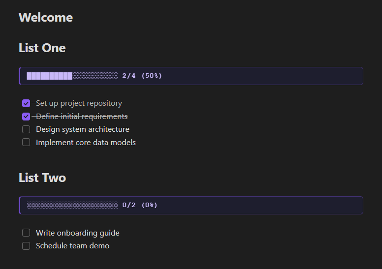

# Checklist Progress Bar

Automatically display a live progress bar above any checklist block in your Obsidian notes.



---

## How It Works

Place a `> [!progress]` callout directly above a checklist block. The plugin will automatically calculate how many items are checked and update the progress bar in real time as you tick things off.

```
> [!progress] ███████████░░░░░░░░░ 9/16 (56%)

- [x] Set up project repository
- [x] Define initial requirements
- [ ] Design system architecture
- [ ] Implement core data models
...
```

No configuration needed — just drop in the callout and start checking things off.

---

## Usage

1. Open any note with a checklist
2. Add the following line directly above your list:

```
> [!progress]
```

3. The progress bar updates automatically as you check and uncheck items

> **Note:** The `> [!progress]` line must appear directly before your checklist block. Items are counted from that line down to the next progress bar or end of file.

---

## Features

- Live updates on every keystroke — no need to reload or save
- Supports nested checklist items at any indentation level
- Multiple progress bars per note, each tracking its own block
- Clean callout styling with both dark and light theme support
- Zero configuration required

---

## Installation

### Via Community Plugins *(recommended)*
1. Open Obsidian and go to **Settings → Community Plugins**
2. Search for **Checklist Progress Bar**
3. Click **Install**, then **Enable**

### Manual
1. Download the latest release from [GitHub Releases](https://github.com/)
2. Copy `main.js`, `manifest.json`, and `styles.css` into your vault at:
   ```
   <vault>/.obsidian/plugins/checklist-progress-bar/
   ```
3. Restart Obsidian and enable the plugin under **Settings → Community Plugins**

---

## Compatibility

- Obsidian **v1.0.0** and above
- Works in both **Live Preview** and **Reading** mode

---

## Feedback & Contributions

Found a bug or have a feature request? Open an issue on [GitHub](https://github.com/). Pull requests are welcome.
